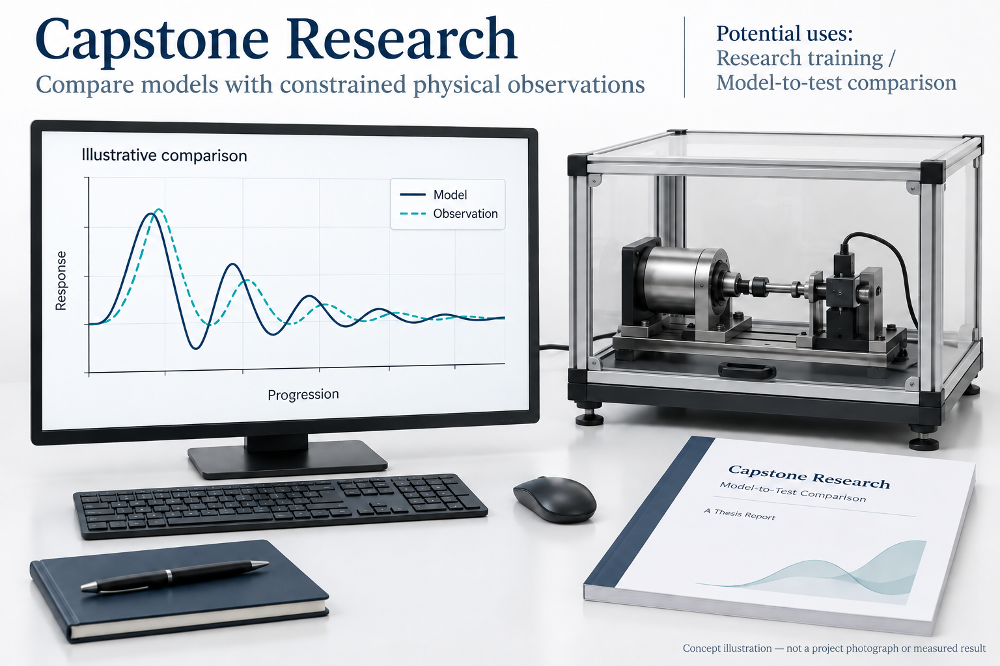
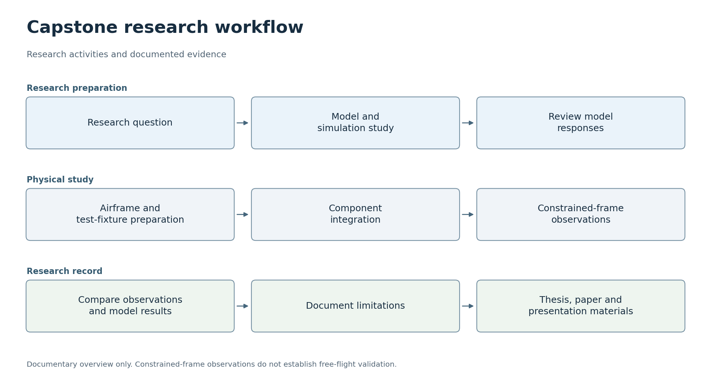

# 졸업연구 · 모델링과 실험 검증

[한국어](#korean) · [English](#english)

## 한국어

2026년 한동대학교에서 진행한 2인 졸업연구입니다. 무인기 연구에서 모델과 실물 시험 장치의 응답을 비교하고, 기체 제작과 소프트웨어·센서·구동부를 통합하는 과정을 다뤘습니다. 연구 주제는 VTOL 재사용 인터셉터 드론이었으며, 이 저장소는 연구의 구성과 수행 이력, 확인한 결과를 설명하는 문서형 기록입니다. 실행 코드나 운용 지침은 포함하지 않습니다.

### 프로젝트 목표

연구 모델의 예상 응답과 시험 프레임에서 관찰한 실물 응답을 비교하고, 차이와 확인 범위를 연구 기록으로 남기는 프로젝트입니다.

AI로 생성한 목표 설명용 개념 이미지입니다. 장치 외형과 화면·그래프는 예시이며 실제 프로젝트 사진이나 측정 결과가 아닙니다.

### 활용할 수 있는 곳

모델과 실물 응답을 비교하는 과정은 제어·로보틱스 연구에서 시뮬레이션 결과를 시험 장치로 확인하는 실험 설계에 활용할 수 있습니다. 센서·소프트웨어·구동부를 연결하고 차이가 생기는 지점을 기록하는 방식은 연구 장치 통합 교육에도 연결됩니다. 여기서 말하는 활용은 연구 방법과 검증 기록의 활용이며, 프레임 시험 결과를 실제 비행이나 운용 성능으로 확대하는 의미는 아닙니다.

### 전체 흐름

코드와 보고서를 바탕으로 정리한 개략도입니다. 실제 결과와 확인 범위는 아래에 설명합니다. [SVG](docs/flowcharts/capstone.svg)

### 프로젝트 구성과 역할

프로젝트는 연구 모델과 분석, 기체·시험 장치 제작, 장치 통합과 실물 시험, 연구 결과 정리로 구성됐습니다. 전세인은 연구 모델과 시뮬레이션 분석, 기체 및 시험 장치 제작을 담당했습니다. 박상헌은 구성요소를 연결하고 시험 프레임에서 동작을 확인하는 통합 시험, 결과 비교, 논문·발표·시연 자료 정리를 담당했습니다.

여기서 자료 정리 담당과 실제 발표자는 구분합니다. 학술대회 포스터 발표는 전세인이 맡았고, 박상헌은 공동저자로 참여했습니다. 교내 실물 시연과 학회 발표는 별개의 활동입니다. 지도 및 교신저자는 나원상 교수입니다.

구현 과정에는 AI 코딩 도구도 활용했습니다. 담당 업무는 연구에서 수행한 범위를 설명하며, 모든 코드를 도구의 도움 없이 작성했다는 의미는 아닙니다.

### 수행 과정에서 다룬 문제

모델에서 예상한 응답과 시험 장치에서 보이는 움직임이 같지는 않았습니다. 센서 입력, 소프트웨어 처리, 모터 출력, 실제 기체의 반응을 함께 살펴보며 차이가 생기는 지점을 확인했습니다. 모델의 결과만으로 실물 동작을 판단하기 어려웠고, 장치에서 관찰한 응답을 다시 모델과 비교하는 과정이 필요했습니다.

발표 준비 중에는 제어기 고장과 통신 문제도 겪었습니다. 원래 계획한 방식에만 매달리기보다 시연에 필요한 동작을 기준으로 준비를 조정했고, 교내 최종발표에서 시험 프레임에 설치한 기체의 동작을 보여 주었습니다.

### 결과와 확인 범위

교내 최종발표에서는 외란을 받은 기체가 시험 프레임의 기준 자세로 돌아오는 동작을 시연했습니다. 이 결과는 프레임에 구속된 조건에서 관찰한 실물 응답입니다. 자유비행이나 전체 유도·비행 시스템의 통합 검증을 완료한 결과로 해석하지 않습니다.

연구 내용은 학위논문과 별도의 학술대회 논문으로 정리했습니다. 학술대회 포스터 발표는 전세인이 맡았으며 박상헌은 공동저자로 참여했습니다. 교내 실물 시연과 학회 발표는 서로 다른 활동입니다.

### 결과를 읽을 때 구분할 점

모델에서 확인한 응답, 시험 프레임에서 관찰한 동작, 학위논문과 학술대회 논문은 서로 다른 근거입니다. 모델과 실물의 차이를 살펴본 과정은 수행 과정에, 시연에서 관찰한 내용은 결과에, 공동저자와 발표 이력은 아래 학술 기록에 정리했습니다. 프레임에 구속된 시험 결과를 자유비행이나 전체 시스템의 검증으로 확대하지 않습니다.

### 관련 학술 기록

- 학위논문: *Composite Guidance-Based Impact-Angle Control and Hardware Implementation for Low-Cost UAVs*
- 학술대회 논문: 「저가형 무인기의 입사각 제어를 위한 복합 유도기법 설계」
- 학술대회: 2026년도 대한전기학회 하계학술대회
- 포스터 발표일: 2026년 7월 9일
- 학술대회 논문 저자: 전세인(포스터 발표), 박상헌(공동저자), 나원상(교신저자)

학위논문과 학술대회 논문은 서로 다른 산출물입니다. 이 문서에는 연구 수행 이력과 검증 범위만 수록했습니다.

---

## English

**Capstone Research: Modelling and Experimental Validation**

This was a 2-person capstone research project conducted at Handong Global University in 2026. It examined the process of comparing the responses of a model and a physical test apparatus in UAV research, building the aircraft, and integrating software, sensors and actuators. The research topic was a reusable VTOL interceptor drone. This repository is a documentary record describing the research structure, work carried out and observed results. It contains no executable code or operational instructions.

### Project goal

The project compares the responses predicted by the research model with the physical responses observed on a test frame, and records the differences and the scope of verification as a research record.

This is an AI-generated concept image illustrating the project goal. The device appearance, screens and graphs are examples, not actual project photographs or measured results.

### Where it could be used

The process of comparing model and physical responses can inform experimental design in control and robotics research, where simulation results are checked using a test apparatus. Connecting sensors, software and actuators and recording where differences arise can also support education in research apparatus integration. These uses refer to the research methods and verification records; they do not extend the test-frame results to actual flight or operational performance.

### Overall workflow

An overview prepared from the code and report. The actual results and scope of verification are described below. [SVG](docs/flowcharts/capstone.svg)

### Project structure and roles

The project comprised research modelling and analysis, aircraft and test apparatus construction, apparatus integration and physical testing, and documentation of the research results. 전세인 was responsible for the research model, simulation analysis, and construction of the aircraft and test apparatus. Sangheon Park (박상헌) was responsible for integration tests that connected the components and checked their behaviour on the test frame, comparison of results, and preparation of paper, presentation and demonstration materials.

Responsibility for preparing materials is distinguished here from the role of the actual presenter. 전세인 gave the conference poster presentation, and Sangheon Park (박상헌) participated as a co-author. The on-campus physical demonstration and the conference presentation were separate activities. Professor 나원상 was the supervisor and corresponding author.

AI coding tools were also used during implementation. The responsibilities describe the work carried out in the research; they do not imply that all code was written without tool assistance.

### Issues addressed during the work

The responses predicted by the model did not exactly match the movements observed in the test apparatus. Sensor inputs, software processing, motor outputs and the physical aircraft's response were examined together to identify where differences arose. Model results alone were insufficient to judge physical behaviour, and the responses observed in the apparatus needed to be compared with the model again.

Controller failure and communication problems also occurred during presentation preparation. Rather than adhering only to the original plan, preparations were adjusted around the behaviour needed for the demonstration. At the final on-campus presentation, the team demonstrated the behaviour of the aircraft mounted on the test frame.

### Results and scope of verification

At the final on-campus presentation, the team demonstrated the aircraft returning to the test frame's reference attitude after a disturbance. This was a physical response observed under frame-constrained conditions. It should not be interpreted as completed validation of free flight or integrated validation of the full guidance and flight system.

The research was documented in a thesis and a separate conference paper. 전세인 gave the conference poster presentation, and Sangheon Park (박상헌) participated as a co-author. The on-campus physical demonstration and the conference presentation were different activities.

### Distinctions to keep in mind when reading the results

The responses examined in the model, the behaviour observed on the test frame, and the thesis and conference paper are different forms of evidence. The process of examining differences between the model and physical apparatus is described in the account of the work, the observations from the demonstration are described in the results, and the co-authorship and presentation history are listed in the academic record below. Frame-constrained test results are not extended to validation of free flight or the full system.

### Related academic record

- Thesis: *Composite Guidance-Based Impact-Angle Control and Hardware Implementation for Low-Cost UAVs*
- Conference paper: “Design of a Composite Guidance Method for Impact-Angle Control of Low-Cost UAVs” (「저가형 무인기의 입사각 제어를 위한 복합 유도기법 설계」)
- Conference: 2026 Summer Conference of the Korean Institute of Electrical Engineers
- Poster presentation date: 2026-07-09
- Conference paper authors: 전세인 (poster presenter), Sangheon Park (박상헌; co-author), 나원상 (corresponding author)

The thesis and conference paper are separate outputs. This document contains only the history of the research work and the scope of verification.
